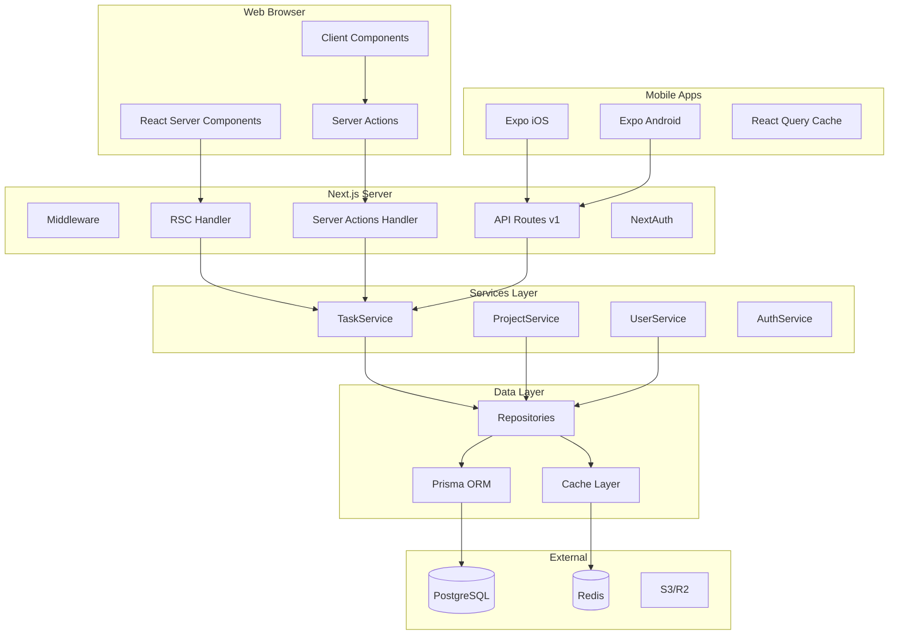
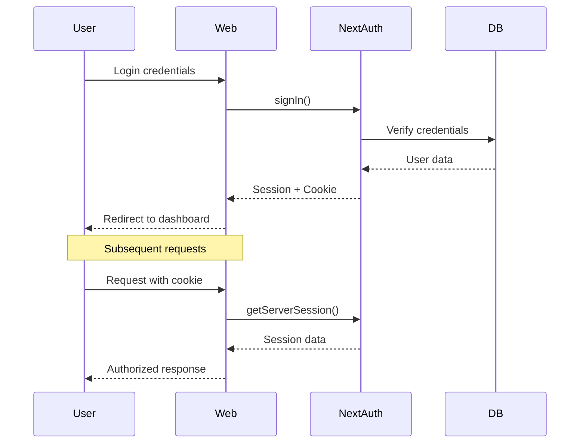
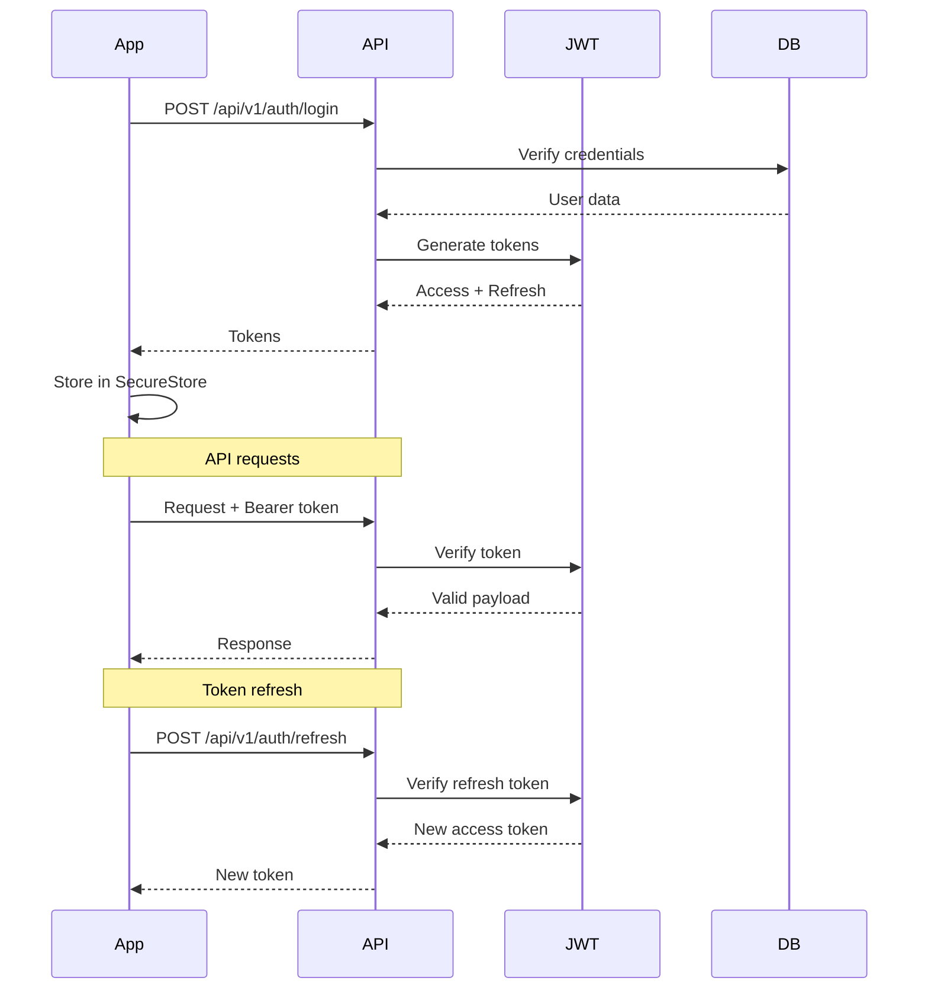
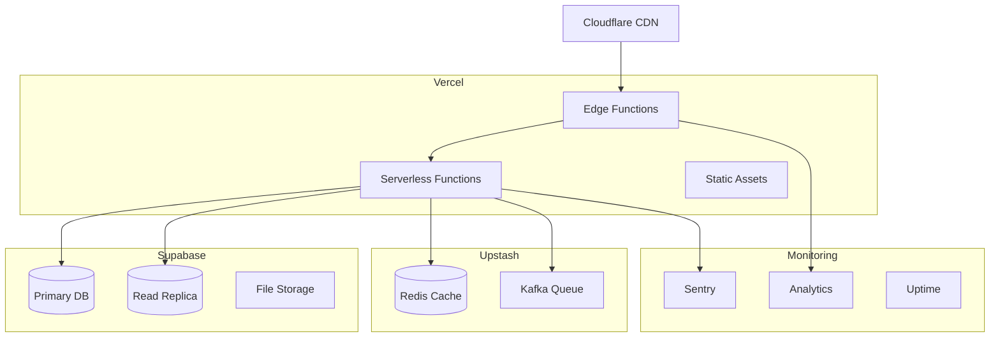

# 🏗️ BMAD Architecture Document
## TaskFlow Pro - Arquitectura Técnica Detallada

---

## 🎯 Principios Arquitectónicos

### 1. Simplicidad Extrema
- **NO** microservicios hasta 100k usuarios
- **NO** GraphQL sin necesidad real
- **NO** abstracciones prematuras
- **SÍ** monolito bien estructurado
- **SÍ** código aburrido que funciona

### 2. Performance First
- Server Actions: <100ms response
- Mobile API: <200ms response  
- Zero client-side data fetching en web
- Optimistic updates everywhere

### 3. Developer Experience
- Type safety end-to-end
- Hot reload en todo
- No build steps complejos
- Errores descriptivos

---

## 🏛️ Arquitectura General



---

## 📁 Estructura de Carpetas

```bash
bmad-nextjs-app/
├── app/                           # Next.js App Router
│   ├── (web)/                    # Grupo de rutas web
│   │   ├── (auth)/               # Rutas autenticadas
│   │   │   ├── dashboard/
│   │   │   ├── tasks/
│   │   │   └── projects/
│   │   └── (public)/             # Rutas públicas
│   │       ├── login/
│   │       └── register/
│   ├── api/
│   │   └── v1/                   # API REST para mobile
│   │       ├── auth/
│   │       │   ├── login/route.ts
│   │       │   ├── refresh/route.ts
│   │       │   └── logout/route.ts
│   │       ├── tasks/
│   │       │   └── route.ts     # GET, POST
│   │       │   └── [id]/route.ts # GET, PATCH, DELETE
│   │       └── health/route.ts
│   └── actions/                  # Server Actions
│       ├── tasks.ts
│       ├── projects.ts
│       └── auth.ts
├── lib/                          # Lógica de negocio
│   ├── services/                # Business logic
│   │   ├── base.service.ts
│   │   ├── task.service.ts
│   │   ├── project.service.ts
│   │   └── auth.service.ts
│   ├── repositories/            # Data access
│   │   ├── base.repository.ts
│   │   ├── task.repository.ts
│   │   └── project.repository.ts
│   ├── validations/             # Zod schemas
│   │   ├── task.schema.ts
│   │   ├── project.schema.ts
│   │   └── auth.schema.ts
│   ├── utils/                   # Utilidades
│   │   ├── rate-limit.ts
│   │   ├── logger.ts
│   │   ├── metrics.ts
│   │   └── errors.ts
│   └── config/                  # Configuración
│       ├── env.ts               # Variables validadas
│       ├── constants.ts
│       └── prisma.ts           # Singleton client
├── components/                   # Componentes React
│   ├── ui/                     # shadcn/ui
│   ├── features/               # Feature components
│   └── layouts/                # Layout components
├── prisma/
│   ├── schema.prisma
│   ├── migrations/
│   └── seed.ts
├── mobile/                      # Expo app
│   ├── app/                    # Expo Router
│   ├── components/
│   ├── services/               # API client
│   ├── stores/                 # Zustand stores
│   └── utils/
├── tests/
│   ├── unit/
│   ├── integration/
│   └── e2e/
└── docs/                        # BMAD documentation
```

---

## 🔧 Stack Tecnológico Detallado

### Backend/Web
```json
{
  "dependencies": {
    "next": "15.0.3",
    "react": "19.0.0",
    "react-dom": "19.0.0",
    "@prisma/client": "6.0.1",
    "next-auth": "5.0.0-beta.25",
    "zod": "3.24.1",
    "@upstash/redis": "1.34.3",
    "@upstash/ratelimit": "2.0.5",
    "bcryptjs": "2.4.3"
  },
  "devDependencies": {
    "typescript": "5.7.2",
    "prisma": "6.0.1",
    "@types/node": "22.10.2",
    "@types/react": "19.0.1",
    "tailwindcss": "3.4.17",
    "vitest": "2.1.8",
    "@playwright/test": "1.49.1"
  }
}
```

### Mobile (Expo)
```json
{
  "dependencies": {
    "expo": "~52.0.0",
    "expo-router": "~4.0.0",
    "react-native": "0.76.5",
    "@tanstack/react-query": "5.62.0",
    "zustand": "5.0.2",
    "react-native-mmkv": "3.1.0",
    "nativewind": "4.1.0",
    "react-native-reanimated": "~3.16.0",
    "expo-secure-store": "~14.0.0",
    "zod": "3.24.1"
  }
}
```

---

## 🏗️ Patrones y Decisiones Arquitectónicas

### 1. Service Layer Pattern

```typescript
// lib/services/base.service.ts
export abstract class BaseService {
  protected logger = logger.child({ service: this.constructor.name })
  
  protected async executeWithMetrics<T>(
    operation: string,
    fn: () => Promise<T>
  ): Promise<T> {
    const start = Date.now()
    
    try {
      const result = await fn()
      
      metrics.histogram('service.operation.duration', Date.now() - start, {
        service: this.constructor.name,
        operation,
        status: 'success'
      })
      
      return result
    } catch (error) {
      metrics.increment('service.operation.error', {
        service: this.constructor.name,
        operation
      })
      
      this.logger.error(`Operation ${operation} failed`, { error })
      throw error
    }
  }
}

// lib/services/task.service.ts
export class TaskService extends BaseService {
  constructor(
    private taskRepo: TaskRepository,
    private cacheService: CacheService
  ) {
    super()
  }
  
  async createTask(data: CreateTaskInput, userId: string) {
    return this.executeWithMetrics('createTask', async () => {
      // Validación de negocio
      if (await this.taskRepo.countByUser(userId) >= 1000) {
        throw new BusinessError('Task limit reached')
      }
      
      // Crear tarea
      const task = await this.taskRepo.create({
        ...data,
        userId
      })
      
      // Invalidar cache
      await this.cacheService.invalidate(`user:${userId}:tasks`)
      
      // Event para otros servicios
      await this.eventBus.emit('task.created', task)
      
      return task
    })
  }
}
```

### 2. Repository Pattern

```typescript
// lib/repositories/base.repository.ts
export abstract class BaseRepository<T> {
  constructor(protected prisma: PrismaClient) {}
  
  protected handlePrismaError(error: any): never {
    if (error.code === 'P2002') {
      throw new ConflictError('Duplicate entry')
    }
    if (error.code === 'P2025') {
      throw new NotFoundError('Record not found')
    }
    throw error
  }
}

// lib/repositories/task.repository.ts
export class TaskRepository extends BaseRepository<Task> {
  async create(data: CreateTaskData): Promise<Task> {
    try {
      return await this.prisma.task.create({ data })
    } catch (error) {
      this.handlePrismaError(error)
    }
  }
  
  async findByUser(
    userId: string,
    options?: { 
      limit?: number
      offset?: number
      status?: TaskStatus 
    }
  ): Promise<Task[]> {
    return this.prisma.task.findMany({
      where: { 
        userId,
        ...(options?.status && { status: options.status })
      },
      take: options?.limit ?? 20,
      skip: options?.offset ?? 0,
      orderBy: { createdAt: 'desc' }
    })
  }
}
```

### 3. Server Actions Pattern

```typescript
// app/actions/tasks.ts
'use server'

import { revalidatePath, revalidateTag } from 'next/cache'
import { taskService } from '@/lib/services'
import { CreateTaskSchema } from '@/lib/validations'
import { rateLimit } from '@/lib/utils/rate-limit'
import { getServerSession } from 'next-auth'

export async function createTask(formData: FormData) {
  // 1. Auth check
  const session = await getServerSession()
  if (!session?.user) {
    return { error: 'Unauthorized' }
  }
  
  // 2. Rate limiting
  const { success, remaining } = await rateLimit.check(
    `create-task:${session.user.id}`,
    { limit: 10, window: 60 }
  )
  
  if (!success) {
    return { 
      error: 'Too many requests. Try again later.',
      remaining 
    }
  }
  
  // 3. Validation
  const rawData = Object.fromEntries(formData)
  const validated = CreateTaskSchema.safeParse(rawData)
  
  if (!validated.success) {
    return { 
      error: 'Invalid data',
      fieldErrors: validated.error.flatten().fieldErrors
    }
  }
  
  // 4. Business logic
  try {
    const task = await taskService.createTask(
      validated.data,
      session.user.id
    )
    
    // 5. Revalidation
    revalidatePath('/tasks')
    revalidateTag(`user-tasks-${session.user.id}`)
    
    return { data: task }
    
  } catch (error) {
    if (error instanceof BusinessError) {
      return { error: error.message }
    }
    
    logger.error('Create task failed', { 
      error,
      userId: session.user.id,
      data: validated.data
    })
    
    return { error: 'Failed to create task' }
  }
}
```

### 4. API Routes Pattern (Mobile)

```typescript
// app/api/v1/tasks/route.ts
import { NextRequest, NextResponse } from 'next/server'
import { taskService } from '@/lib/services'
import { CreateTaskSchema } from '@/lib/validations'
import { verifyJWT } from '@/lib/auth'

export async function POST(request: NextRequest) {
  // 1. Auth
  const token = request.headers.get('authorization')?.replace('Bearer ', '')
  const payload = await verifyJWT(token)
  
  if (!payload) {
    return NextResponse.json(
      { error: 'Unauthorized' },
      { status: 401 }
    )
  }
  
  // 2. Parse & validate
  const body = await request.json()
  const validated = CreateTaskSchema.safeParse(body)
  
  if (!validated.success) {
    return NextResponse.json(
      { 
        error: 'Validation failed',
        details: validated.error.flatten()
      },
      { status: 400 }
    )
  }
  
  // 3. Business logic (reusa el mismo servicio)
  try {
    const task = await taskService.createTask(
      validated.data,
      payload.userId
    )
    
    return NextResponse.json({ data: task })
    
  } catch (error) {
    if (error instanceof BusinessError) {
      return NextResponse.json(
        { error: error.message },
        { status: 400 }
      )
    }
    
    logger.error('API create task failed', { error })
    
    return NextResponse.json(
      { error: 'Internal server error' },
      { status: 500 }
    )
  }
}

export async function GET(request: NextRequest) {
  // Similar pattern para listar
}
```

---

## 🔐 Seguridad

### Authentication Flow



### Mobile Auth Flow



### Security Checklist

- [x] Rate limiting en todos los endpoints
- [x] Input validation con Zod
- [x] SQL injection prevention (Prisma)
- [x] XSS prevention (React)
- [x] CSRF protection (Next.js)
- [x] Secure headers (middleware)
- [x] Environment variables validation
- [x] Secrets rotation strategy
- [x] Audit logging

---

## 🚀 Deployment Architecture

### Environments

```yaml
Development:
  - URL: http://localhost:3000
  - DB: SQLite local
  - Cache: In-memory
  - Auth: Mock provider

Staging:
  - URL: https://staging.taskflow.app
  - DB: PostgreSQL (Supabase)
  - Cache: Redis (Upstash)
  - Auth: Real providers

Production:
  - URL: https://taskflow.app
  - DB: PostgreSQL (Supabase) + Read replicas
  - Cache: Redis (Upstash) + CDN
  - Auth: Real providers + MFA
```

### Infrastructure



---

## 📊 Performance Targets

### Web Metrics
```yaml
Core Web Vitals:
  LCP: < 2.5s
  FID: < 100ms  
  CLS: < 0.1
  TTFB: < 200ms

Custom Metrics:
  Server Action p50: < 50ms
  Server Action p95: < 100ms
  Server Action p99: < 200ms
  
Page Load:
  Homepage: < 1s
  Dashboard: < 1.5s
  Task List (1000 items): < 2s
```

### Mobile Metrics
```yaml
API Response Times:
  GET /tasks p50: < 100ms
  GET /tasks p95: < 200ms
  POST /tasks p50: < 150ms
  POST /tasks p95: < 300ms

App Performance:
  Cold start: < 2s
  Screen transition: < 300ms
  List scroll: 60fps
  Pull to refresh: < 500ms
```

---

## 🔄 Scaling Strategy

### Phase 1: MVP (0-1k users)
- Single Next.js instance
- SQLite/PostgreSQL
- No cache needed
- Basic monitoring

### Phase 2: Growth (1k-10k users)
- Vercel auto-scaling
- PostgreSQL with indexes
- Redis cache
- Rate limiting
- Error tracking

### Phase 3: Scale (10k-100k users)
- Read replicas
- Queue for heavy operations
- CDN for assets
- Advanced monitoring
- Regional deployment

### Phase 4: Enterprise (100k+ users)
- Multi-region deployment
- Database sharding
- Event-driven architecture
- GraphQL federation
- Dedicated infrastructure

---

## ⚠️ Technical Debt Tracking

### Acceptable Debt (for MVP)
- [ ] No integration tests (solo unit y E2E)
- [ ] Basic error messages (no i18n)
- [ ] Simple rate limiting (no distributed)
- [ ] No audit log UI (solo DB)
- [ ] Manual deployment (no GitOps)

### Unacceptable Debt
- [ ] No error handling
- [ ] No input validation
- [ ] Plain text passwords
- [ ] No rate limiting
- [ ] No logging
- [ ] SQL injection vulnerable
- [ ] No auth

---

## 📝 ADRs (Architecture Decision Records)

### ADR-001: Server Actions over REST API for Web
**Status**: Accepted
**Context**: Need fast, type-safe server communication
**Decision**: Use Server Actions for web, REST for mobile
**Consequences**: 
- (+) Better DX, type safety, performance
- (-) Can't use Postman, harder to test

### ADR-002: PostgreSQL over MongoDB
**Status**: Accepted  
**Context**: Need relational data with transactions
**Decision**: PostgreSQL with Prisma ORM
**Consequences**:
- (+) ACID, relations, better for our domain
- (-) More rigid schema, migrations needed

### ADR-003: Zustand over Redux for Mobile
**Status**: Accepted
**Context**: Need simple state management
**Decision**: Zustand + MMKV for persistence
**Consequences**:
- (+) Simple, small, fast
- (-) Less ecosystem, no time travel

---

*"Una arquitectura simple bien ejecutada supera a una compleja mal implementada"* - Roberto, Tech Lead