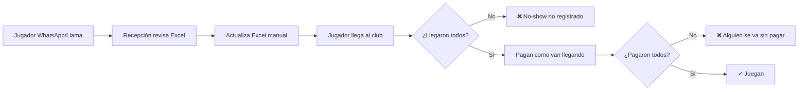

# 🎾 Product Discovery - Sistema de Gestión Clubes de Padel México

## 📊 PROBLEMA ACTUAL CONFIRMADO

### Operación con Excel
- **Una hoja por semana** - revisión manual antes de cada reserva
- **WhatsApp como canal principal** - una persona centraliza y actualiza
- **Sin automatización** - proceso 100% manual

### Dolores Críticos Identificados
1. **Reservas dobles** - pérdida de confianza y dinero
2. **CERO analytics** - no saben:
   - Ingreso por cancha
   - Horas pico vs valle
   - Rentabilidad por horario
3. **Sin gestión de promociones** - difícil hacer happy hour, descuentos
4. **Sin base de clientes** - no saben cuántos ni quiénes son
5. **Pagos divididos caóticos** - "papelitos" para 4 jugadores distintos

### Segmentos de Mercado
| Tipo | Canchas | Reservas/día | Precio/hora | Pain Level |
|------|---------|--------------|-------------|------------|
| Club Grande | 10+ | 80-120 | $500-700 | CRÍTICO |
| Club Mediano | 7-9 | 50-70 | $450-600 | ALTO |
| Club Pequeño | 4-6 | 30-40 | $350-500 | MEDIO |

### Insight Clave: Pagos Divididos
**"Una reserva, 4 pagadores diferentes"** - Único en padel vs otros deportes
- Tenis: 1-2 personas pagan
- Futbol: 1 organizador paga
- **Padel: 4 amigos dividen** ← Oportunidad diferenciadora

## 🎯 ANÁLISIS COMPETITIVO

### Playtomic (Líder Europeo)
| Aspecto | Detalle | Problema para México |
|---------|---------|---------------------|
| **Precio** | €250/mes base | $5,500 MXN + comisiones |
| **Comisiones** | Doble cobro | Al club Y al usuario |
| **Moneda** | Euros | Riesgo cambiario |
| **Features** | Solo reservas en plan base | Torneos/ligas son extra € |
| **Target** | Clubes europeos premium | Overpriced para México |

### Paddeo (Intento Local)
| Aspecto | Detalle | Por qué falla |
|---------|---------|--------------|
| **UX/UI** | Proyecto universitario | No es profesional |
| **Confiabilidad** | Dudosa | Clubs no confían datos |
| **Soporte** | Limitado | Sin respuesta rápida |
| **Features** | Básicas | No resuelve problemas reales |

### Features Valoradas (Que SÍ debemos tener)
✅ **Organización de torneos** - Incrementa ingresos 30-40%
✅ **Gestión de ligas** - Fidelización de clientes
✅ **Gestión de clases** - Revenue stream adicional
✅ **Reservas online** - Expectativa básica

## 💡 OPORTUNIDAD DE MERCADO

### Nuestra Ventaja Competitiva
1. **Precio en MXN** - Sin riesgo cambiario
2. **Freemium real** - Reservas 100% gratis
3. **Pagos divididos nativos** - Feature único
4. **Módulo financiero** - Nadie lo tiene
5. **Soporte local** - En español, horario México

### Pricing Estratégico
```
Playtomic: €250 + comisiones (≈$6,000 MXN/mes)
Paddeo: Precio bajo pero no confiable
NOSOTROS: $0 reservas | $2,000 MXN torneos | $1,500 MXN finanzas
```

## 👥 USUARIOS Y FLUJOS ACTUALES

### Roles del Sistema
| Rol | Acceso | Responsabilidades | Pain Points |
|-----|--------|------------------|-------------|
| **Dueño/Admin** | TOTAL | Ver todo, analytics, finanzas | Sin visibilidad de métricas |
| **Recepcionista** | Operativo | Check-in, cobros, reservas | Papelitos, no sabe quién pagó |
| **Jugador Registrado** | App/Web | Reservar, ver historial, beneficios | No puede reservar online |
| **Jugador Visitante** | App/Web | Reserva rápida sin registro | Debe llamar/WhatsApp |
| **Profesor** | Limitado | Gestionar sus clases/alumnos | Sin control de su agenda |

### Flujo Actual ROTO de Reservas


### 💸 PROBLEMA CRÍTICO: Pagos Divididos
**Situación actual CAÓTICA:**
- 4 jugadores = 4 pagos separados
- Pagan en diferentes momentos
- Recepción con "papelitos" 
- **30% se va sin pagar** (estimado)
- Otros cubren al moroso
- Sin registro de deudores

### 📊 Políticas y Precios
| Aspecto | Situación Actual | Oportunidad |
|---------|-----------------|-------------|
| **Precios diferenciados** | Sí (día/hora) | Automatizar happy hours |
| **Cancelaciones** | No se gestionan | Cobrar no-shows |
| **No-shows** | No se registran | Lista negra automática |
| **Lista espera** | No existe | Revenue adicional |
| **Membresías** | No hay | Oportunidad futura |

## 🚨 INSIGHTS CLAVE DESCUBIERTOS

### 1. **Revenue Leakage Masivo**
- No-shows no penalizados = -15% ingresos
- Jugadores que no pagan = -10% ingresos  
- Sin lista de espera = -20% ocupación
- **Total: -45% de revenue potencial perdido**

### 2. **Cero Data Intelligence**
- No saben quién es cliente frecuente
- No saben horas pico reales
- No pueden hacer promociones targeted
- No identifican morosos recurrentes

### 3. **Operación Manual Costosa**
- 1 persona full-time actualizando Excel
- Errores de doble reserva = clientes molestos
- Sin automatización = no escala

## 🚀 MVP - MÓDULO DE RESERVAS

### Features Core del MVP

#### 1. **Vistas de Disponibilidad**
- Vista **DÍA**: Timeline de cada cancha
- Vista **SEMANA**: Grid semanal  
- Vista **MES**: Calendario con ocupación
- Estados: Disponible | Reservado | En juego | Bloqueado

#### 2. **Widget Embebible** 🎯
```html
<!-- Club pega esto en su website -->
<iframe src="https://padelapp.mx/widget/club-xyz" 
        width="100%" height="600">
</iframe>
```
- Sin necesidad de desarrollo del club
- Branded con logo del club
- Responsive para móvil

#### 3. **App Multi-Club** 
**NO es app del club, es LA app del padel en México**
- Jugadores ven TODOS los clubes
- Un solo registro para jugar anywhere
- Historial unificado
- Puntos/beneficios cross-club

#### 4. **Pagos Divididos REVOLUCIONARIO** 💰
```
DEFAULT: 1 jugador paga todo
OPCIÓN: "¿Dividir entre 4?" → Link único para cada jugador
```
- Cada club conecta SU Stripe
- Nosotros NO tocamos el dinero
- Cancha bloqueada al reservar
- Status: 0/4 pagado | 2/4 pagado | 4/4 listo

#### 5. **Confirmaciones WhatsApp**
- Reserva confirmada → WhatsApp a los 4
- Recordatorio 2hrs antes
- Link de pago si falta alguien
- Notificación de cancelación

#### 6. **Check-in Recepción**
Dashboard recepcionista:
- Lista de reservas del día
- Status de pagos (quién debe)
- Botón CHECK-IN
- Marcar no-shows
- Cobrar pendientes

### Configuración Inicial

#### Setup del Club
```yaml
Paso 1: Datos básicos
  - Nombre, logo, dirección
  - Horarios (ej: L-V 7am-11pm)
  - Número de canchas personalizable

Paso 2: Precios
  - Matriz precio/hora/día
  - Sin políticas automáticas (por ahora)

Paso 3: Stripe Connect
  - Club conecta SU cuenta
  - Dinero directo a ellos

Paso 4: Widget
  - Copiar código embed
  - Personalizar colores
```

#### Migración de Excel
- Template Excel proporcionado
- Columnas: Fecha | Hora | Cancha | Cliente | Teléfono | Email
- Import masivo día 1
- Histórico para analytics

#### Club Demo
```
Club: "Padel Demo Puebla"
Canchas: 8
Reservas: 300 últimos 30 días
Clientes: 150 ficticios
Torneos: 2 activos
```
Para training y demos comerciales

### NO incluido en MVP (Phase 2)
❌ Políticas de cancelación automáticas
❌ Anticipos obligatorios  
❌ Penalizaciones no-show
❌ Membresías
❌ Torneos/Ligas
❌ Clases
❌ Módulo financiero

## 💰 MODELO DE NEGOCIO

### Estrategia Freemium AGRESIVA
| Módulo | Precio | Justificación |
|--------|--------|---------------|
| **Reservas** | $0 MXN FOREVER | Hook de adquisición |
| **Competición** | $2,000 MXN/mes | Torneos + Ligas + Clases |
| **Finanzas** | $1,500 MXN/mes | Reportes + Analytics (futuro) |
| **Comisiones** | 0% | Solo Stripe cobra su % |

### Economics del Modelo
```
30 clubes en Puebla
x 50% adopción módulo competición (15 clubes)
x $2,000 MXN/mes
= $30,000 MXN/mes revenue

Costos estimados:
- Infraestructura: $4,000 MXN/mes
- WhatsApp API: $2,000 MXN/mes
- Soporte: $10,000 MXN/mes (1 persona)
= $16,000 MXN/mes costos

Profit: $14,000 MXN/mes en Puebla solo
```

### ¿Por qué funciona?
1. **Reservas gratis** = Adopción instantánea 100%
2. **Datos de 30 clubes** = Monopolio local
3. **Network effects** = Jugadores quieren 1 app
4. **Upsell natural** = Torneos generan +40% revenue al club

## 🚀 GO-TO-MARKET PUEBLA

### Fase 1: Land Grab (Mes 1-2)
```
Semana 1-2: Club Demo listo
Semana 3-4: Onboarding primeros 5 clubes early adopters
Semana 5-6: Refinamiento con feedback
Semana 7-8: Push para 30 clubes
```

### Ventaja Competitiva LOCAL
- **Conocemos a TODOS los dueños** ✅
- **30 clubes** = mercado completo
- **Relación personal** > Marketing digital
- **Soporte presencial** si needed

### Pitch para Clubes
> "Sistema GRATIS de reservas. Ya no más Excel.
> Sus clientes reservan online, ustedes ven todo en tiempo real.
> Widget para su website incluido.
> Si quieren torneos, $2,000/mes. Sin letras chiquitas."

### Estrategia Influencers
- Módulo competición GRATIS para influencers
- Ellos organizan torneos = publicidad
- Clubes ven el sistema en acción
- Conversión natural a pago

## 📊 KPIs DE ÉXITO MVP (3 meses)

### Métricas Críticas
| Métrica | Target 3 meses | Señal de éxito |
|---------|---------------|----------------|
| **Clubes activos** | 30/30 | 100% Puebla |
| **Reservas/mes** | 1,000+ | Adopción real |
| **Usuarios únicos** | 500+ | 50% jugadores |
| **Módulo competición** | 10 clubes | 33% conversión |
| **Revenue** | $20,000 MXN/mes | Near break-even |
| **NPS** | >50 | Clubes felices |

### Señales de Product-Market Fit
✅ Clubs dejan Excel sin mirar atrás
✅ Jugadores piden a clubes que usen la app
✅ Reservas crecen 20% mes a mes
✅ Referrals orgánicos a otros clubes
✅ Cero churn en primeros 3 meses

## 🎯 VISIÓN A 12 MESES

### Expansión Post-Puebla
```
Meses 4-6: Consolidar Puebla + Product improvements
Meses 7-9: CDMX (300 clubes)
Meses 10-12: GDL + MTY (200 clubes)

Proyección: 
- 500 clubes totales
- 200 con módulo competición
- $400,000 MXN/mes revenue
- 10,000+ reservas/mes
```

### Moat Defensivo
1. **Data moat**: Histórico de todos los jugadores
2. **Network moat**: App #1 para jugadores
3. **Switching cost**: Migrar histórico es pain
4. **Brand moat**: "LA app del padel mexicano"

## 🏆 DIFERENCIADORES FINALES

### VS Playtomic
✅ 100% gratis reservas (vs €250/mes)
✅ Precio en MXN sin riesgo
✅ Soporte local en español
✅ Widget embebible
✅ Sin comisiones

### VS Paddeo
✅ Producto profesional
✅ Pagos divididos nativos
✅ WhatsApp integrado
✅ Multi-club marketplace
✅ Confiabilidad enterprise

### VS Excel
✅ Cero dobles reservas
✅ Analytics automático
✅ Clientes reservan 24/7
✅ Control de pagos
✅ Sin "papelitos"

---

**CONCLUSIÓN: Tenemos Product-Market Fit claro en Puebla con path a dominar México**